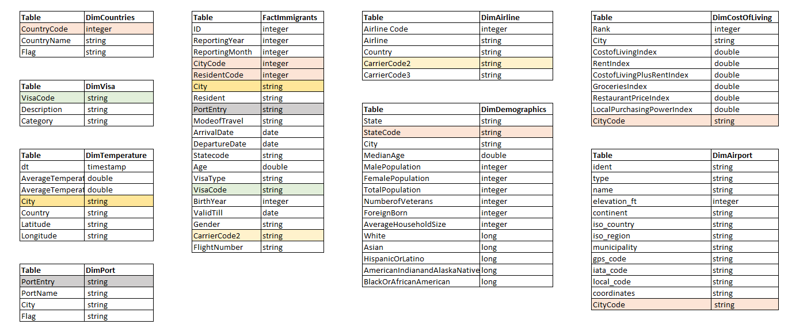

# Project Title
### Data Engineering Capstone Project

#### Project Summary
As a data engineer, We need to decide what would be the best approach for your company in terms of selecting tools, cost /budget, scalability of data, end user, data model, volumetric and so on

First I have chosen Udacity provided dataset, added to that picked some inter-related datasets such as Airline details, Visa Details, Cost of living

So now am very clear with my data and end users, Definitely this might be used by US Immigration and inter related teams.

Coming to possible approaches, 

###### Option 1. Python, S3 for Storage, Spark for Data Processing (Eventually for Big Data), Airflow for scheduling pipelines
		  Data Model    : Star Schema
		  Cost Involve  : Yes
		  Maintenance   : Easy
		  Scalability   : Yes
		  Long Run      : Yes
		  Over all Process: Stage the data into redshift tables as same as source then after processing, can load into Redshift tables, schedule it using airflow
		  

###### Option 2. Python, on-premise drives, Spark / Pandas, Juypter notebook 
		  Data Model    : Star Schema
		  Cost Involve  : No
		  Maintenance   : Difficult
		  Scalability   : No
		  Long Run      : Yes
		  Over all Process: Process the data(Filtering, Cleansing, Transformation) using Spark then after processing, can save the data as Parquet files for Data Analysis
		  		  
I would like / suggest to go for option 1 since it's very reliable approach in terms of scalability, maintenance and long run
but dropping off since Apache airflow environment does not have access to US Immigration data(6GB) and Project Workspace does not have Apache airflow.

The project follows the follow steps:
* Step 1: Scope the Project and Gather Data
* Step 2: Explore and Assess the Data
* Step 3: Define the Data Model
* Step 4: Run ETL to Model the Data
* Step 5: Complete Project Write Up

### Step 1: Scope the Project and Gather Data

In this project, we have collected data from different sources such as Immigration, Temperature, Demographics, Airline and created the data model based on data assessment then performed transformation, filtering, cleansing and finally saved as Parquets file.

It would help data analytics team to get answer following questions

###### Tourism Dept Questions:
1. What is the average tourist count on each month?
2. Which is the most popular cities in US among tourister?
3. What is the age range of tourister?

###### Immigration Dept Questions:
1. What are the top airports used by immigrants while arrival and departure?
2. What are the preferred cities of immigrants by considering rent index?
3. What are the preferred cities of immigrants by considering average temperature?

###### Airline Dept Questions:
1. What are the top airlines used by Immigrants?
2. What are the top visa categories of immigrants?
3. What is the age range of travellers by visa type?

###### Demographic Dept Questions:
1. How much percentage of immigrants adding by race category?
2. What is the percentage of gender equality?
3. What is the percenatge of Foreign born?  

###### Metrological Dept Questions:
1. What would be the temperture of top 5 US cities used by Immigrants in 2030? - Forecasting
2. What is the temperature difference of top 5 US cities preferred by business Immigrants and their orgin?
3. What are the least 5 US cities of Immigrants and its temperature?

#### Describe and Gather Data 
| Dataset                    | Format   | Description                                                                                                                                          | Source Link                                                                        |   |
|----------------------------|----------|------------------------------------------------------------------------------------------------------------------------------------------------------|------------------------------------------------------------------------------------|---|
| I94 Immigration Data       | sas7bdat | This data comes from the US National Tourism and Trade Office                                                                                        | https://travel.trade.gov/research/reports/i94/historical/2016.html                 |   |
| World Temperature Data     | CSV      | Global Land and Ocean-and-Land Temperatures                                                                                                          | https://www.kaggle.com/berkeleyearth/climate-change-earth-surface-temperature-data |   |
| U.S. City Demographic Data | CSV      | This dataset contains information about the demographics of all US cities and census-designated places with a population greater or equal to 65,000. | https://public.opendatasoft.com/explore/dataset/us-cities-demographics/export/     |   |
| Airport Code Table         | CSV      | This is a simple table of airport codes and corresponding cities                                                                                     | https://datahub.io/core/airport-codes#data                                         |   |
| Visa Code                  | CSV      | Describe the classes of admission                                                                                                                    | https://www.dhs.gov/immigration-statistics/nonimmigrant/NonimmigrantCOA            |   |
| Airline Code               | CSV      | Describe Major Airline , Country, Carrier code,                                                                                                      | https://www.kwe.co.jp/en/useful-contents/code1                                     |   |
| Cost of Living             | CSV      | Details of US States Cost of Living categorized by Rent, Groceries, Restaurants, Local Purchasing Power                                              | https://www.numbeo.com/cost-of-living/country_result.jsp?country=United+States     |   |                                    |   |

### Step 2: Explore and Assess the Data
1. **Immigration Dataset**
    * Convert the datatype to integer for cicid,i94yr,i94mon,i94cit,i94res,BIRYEAR
    * Transform i94mode as Air, Sea, Land and Not Reported according to the values else categories as 'NA'
    * Get the city and resident name from country table
    * Convert the SAS date to Readable data format for Arrival and Departure date
    * Transform i94visa as Business, Pleasure and Student according to the values otherwise catgeories as 'NA'
    * Convert the string type to date for DTADDTO
    * Remove duplicates
    * Rename all the columns with proper meaningful name and avoid space or special characters

2. **Demographics Dataset**
    * Transpose the race row values into columns, the New columns are Whitecount, Asiancount, HispanicOrLatinocount, BlackOrAfricanAmerican, AmericanIndianandAlaskaNative
    * Convert the float dataype to integer for Male Population, Female Population, Total Population, Number of Veterans, Foreign-born, Average Household Size
    * Remove duplicates
    * Rename all the columns with proper meaningful name and avoid space or special characters

3. **Temperature Dataset**
    * Remove records having NULL temperature and NULL Dates
    * Convert datatype timestamp to date for dt
    * Remove duplicates
   

4. **Airport Dataset**
    * Remove records where state='closed'
    * Filter only US airports
    * Remove duplicates
    * Derive State code from iso_region
    

5. **Cost of living Dataset**
    * Split the city and city code comma separated values into two
    * Remove duplicates 

6. **Countries**
    * Country dataset is derived from I94_SAS_Labels_Descriptions.SAS
    * Columns are segregated with delimters =
    * Flag column identify valid and invalid records

7. **Port**
    * Port dataset is derived from I94_SAS_Labels_Descriptions.SAS
    * Columns are segregated with delimters ,
    * Flag column identify valid and invalid records
    
    
8. **Airline**
    * No correction in Airline dataset

9. **Visa**
    * No correction in Visa dataset
    
### Step 3: Define the Data Model
#### 3.1 Conceptual Data Model
When designing the data model, we should study the dataset first,  In our case the dataset are Immigration, temperature, demographics, Airport and supporting data's and all it has state,country as common.

As i said earlier, my end user would be Immigration team and they want to analyse immigration key metrics and related data. so i have chosen star model, Immigration dataset act as fact table and rest act as dimension tables

#### 3.2 Mapping Out Data Pipelines

#### Step 4: Data dictionary 
[Data Dictionary Link](https://github.com/Dinesh-Sankaran/P6-Data-Engineer-Capstone/blob/master/Data%20Dictionary.pdf).

#### Step 5: Complete Project Write Up

##### Tools and technologies
As explained earlier, we have selected option 2 for this project as tools and technologies involved are open source and no cost strategy

Option 2. Python, on-premise drives, Spark / Pandas, Juypter notebook

      Data Model    : Star Schema
      Cost Involve  : No
      Maintenance   : Difficult
      Scalability   : No
      Long Run      : Yes
      Over all Process: Process the data(Filtering, Cleansing, Transformation) using Spark then after processing, can save the data as Parquet files for Data Analysis

##### Propose how often the data should be updated and why      
* When considering the whole dataset used in this project, the data frequency should be monthly.

#### Possible Scenario's:
 * ###### In case the data was increased by 100x.
    We can go for the apporach 1, using Redshift, EMR cluster and Airflow would be able to manage scalabilty of data
 * ###### The data populates a dashboard that must be updated on a daily basis by 7am every day.
     By chance if we get daily, then we can schedule the airflow job to run prior to 5hrs of dashboard refresh 
 * ###### The database needed to be accessed by 100+ people.
    Yes we can make it by increasing red shift cluster instance 
